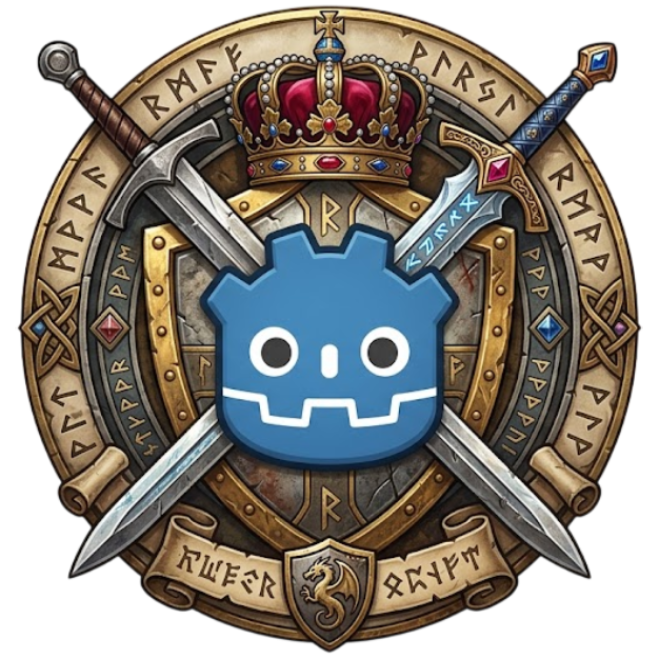

# Godot JRPG

*This is a work-in-progress project*.

Godot JRPG is a framework for building 2D JRPGs (Japanese Role Playing Games) in Godot game engine, inspired by RPG Maker.

## What Godot JRPG is?

- A framework build in Godot game engine for building classic 2D JRPGs like old Final Fantasy series;
- A framework inspired by RPG Maker, specially RPG Maker VX Ace;
- A flexible tool which can be extended with code.

## What Godot JRPG is not?

- A "one-size-fits-all" tool for building RPGs. It doesn't work, for example, for 3D games, action RPGs, or JRPGs with complex battle systems like Fear and Hunger or Don't Look Outside. Nonetheless, you can use it as a base to build your own systems by extending the code;
- An exact copy of RPG Maker. Godot have different approaches, and the main goal is not to avoid coding 100% by creating a "drag and drop" solution with editor tools and buttons that simply create everything like in RPG Maker. Otherwise, Godot RPG have nodes and resources that simplify a lot the process of creating a 2D JRPG.

## Documentation

If you have any question, you can:

- Read the documentation (work-in-progress);
- Press F1 in Godot and search for the class name (work-in-progress).

## Structure

The project is structured in: 

- [Assets](assets/README.md)
- [Nodes](nodes/README.md)
- [Resources](resources/README.md)
- [Tests](tests/README.md)
