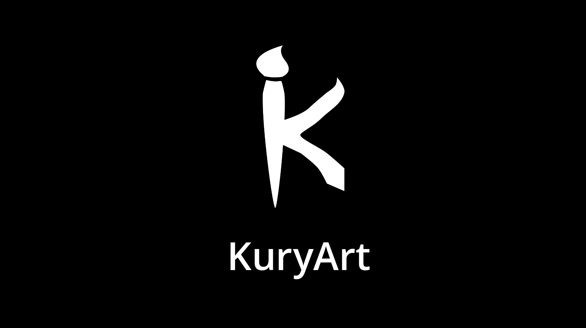
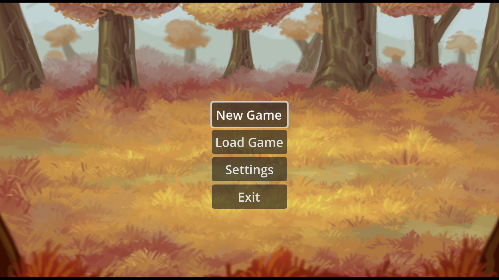
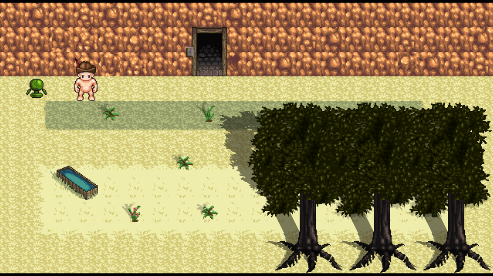
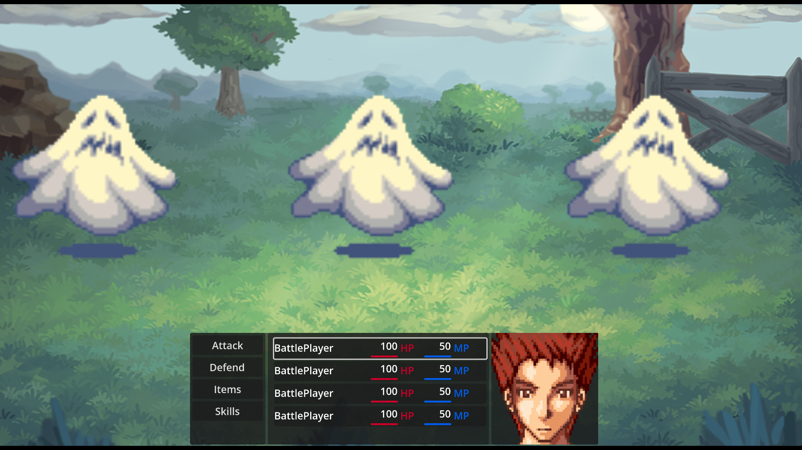
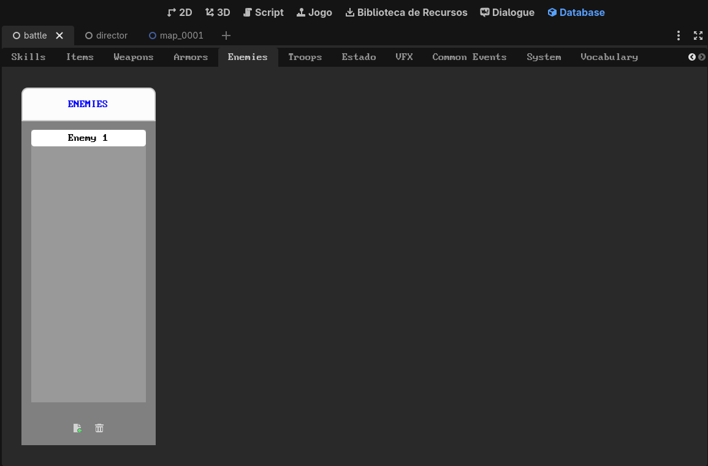

# Godot JRPG

*This is a work-in-progress project*.

Godot JRPG is a framework for building 2D JRPGs (Japanese Role Playing Games) in Godot game engine, inspired by RPG Maker.

## Screenshots

## What Godot JRPG is?

- A framework build in Godot game engine for building classic 2D JRPGs like old Final Fantasy series;
- A framework inspired by RPG Maker, specially RPG Maker VX Ace;
- A flexible tool which can be extended with code.

## What Godot JRPG is not?

- A "one-size-fits-all" tool for building RPGs. It doesn't work, for example, for 3D games, action RPGs, or JRPGs with complex battle systems like Fear and Hunger or Don't Look Outside. Nonetheless, you can use it as a base to build your own systems by extending the code;
- An exact copy of RPG Maker. Godot have different approaches, and the main goal is not to avoid coding 100% by creating a "drag and drop" solution with editor tools and buttons that simply create everything like in RPG Maker. Otherwise, Godot RPG have nodes and resources that simplify a lot the process of creating a 2D JRPG.

## Install

1. Clone repository or install via [Godot Asset Store](https://godotengine.org/asset-library/asset)
2. Install *[gd-plug](https://godotengine.org/asset-library/asset/962)* plugin via [Godot Asset Store](https://godotengine.org/asset-library/asset)
3. Execute: `godot --headless -s plug.gd install` to install third-party plugins.

## Documentation

If you have any question, you can:

- Read the documentation (work-in-progress);
- Press F1 in Godot and search for the class name (work-in-progress).

## Structure

The project is structured in: 

- [Assets](assets/README.md)
- [Editor](editor/README)
- [Nodes](nodes/README.md)
- [Resources](resources/README.md)
- [Tests](tests/README.md)

## Already have features

- Skeleton for a battle system
- Map system
- Skeleton for menu system
- Splash screen
- Main menu
- Skeleton for traits system
- Flexible formulas for damage, hit chance, critical chance and critical damage, so you can create your own calculations
- Flexible formulas for leveling and stats growth, so you can create your own calculations
- Skeleton for database editor, to create enemies, players, classes, skills, items, status, etc.
- Resources and nodes which can help building the game
- More skeletons for status, items, skills, etc.

## Planned features

- Almost all the RPG Maker VX ACE concepts, including Traits, powered by Godot features like tilemap and tilemap layer;
- A separation between logic and UI, to be able to run the battle as a simulation (and export the data to Jupyter Notebook) or to connect to a RL ([Reinforcement Learning](https://en.wikipedia.org/wiki/Reinforcement_learning)) model to have an AI learning how to play your game;
- Controllers to manage who will play: a player? an enemy? a npc? an AI? 
- Local multiplayer (up to 4 player) in battle mode:
	- Plannings to make a network multiplayer;
	- Plannings to make a multiplayer in map too;

## Goals

- [ ] Save/load system;
- [x] Map scene system (we barely have battle system);
- [ ] Menus system;
	- [x] Base for menu system;
- [ ] Use item in battle;
- [ ] Use skill in battle;
- [ ] Defend in battle;
- [ ] Develop traits:
	- [x] Create traits system base;
	- [ ] Integrate traits in gameplay;
- [ ] Victory system;
- [ ] Game over system;
- [ ] Equip system;
- [ ] Develop AI system:
	- [ ] Create headless simulation to export data to Jupyter Notebook;
	- [ ] Create integration with Godot RL Agents plugin;
- [ ] Caterpillar party system;
- [ ] A lot more I can't remember now...

## Dependencies

This addon uses third-party plugins. You can install all at once using [gd-plug](https://github.com/imjp94/gd-plug).

- [Phantom Camera](https://godotengine.org/asset-library/asset/1822), 
- [Dialogue Manager 3](https://godotengine.org/asset-library/asset/3654)
- [Godot Safe Resource Loader](https://godotengine.org/asset-library/asset/2249)
- [gd-plug - Plugin Manager](https://godotengine.org/asset-library/asset/962)
- [gd-plug-ui - Plugin Manager UI](https://godotengine.org/asset-library/asset/1926)
- [Universal Fade](https://godotengine.org/asset-library/asset/1454)
- [Switch Manager](https://godotengine.org/asset-library/asset/2634)

## Credits

### Sprites

- For the tileset: [Hyptosis and Zabin](https://opengameart.org/content/lots-of-free-2d-tiles-and-sprites-by-hyptosis) under CC-BY 3.0 [license](https://creativecommons.org/licenses/by/3.0/);
- For the characters: [wulax](https://opengameart.org/users/wulax) under OGA-BY 3.0 [license](https://static.opengameart.org/OGA-BY-3.0.txt)
- For the battle background: [Nidhoggn](https://opengameart.org/users/nidhoggn) under CC0  [license](https://creativecommons.org/publicdomain/zero/1.0/)
- For the battle enemies: [CharlesGabriel](http://cgartsenal.blogspot.com/) under CC-BY 3.0 [license](https://creativecommons.org/licenses/by/3.0/)
- For the players faces: [CharlesGabriel](http://cgartsenal.blogspot.com/) under CC-BY 3.0 [license](https://creativecommons.org/licenses/by/3.0/)

### Addons

- [derkork/godot-safe-resource-loader](https://github.com/derkork/godot-safe-resource-loader)
- [nathanhoad/godot_dialogue_manager](https://github.com/nathanhoad/godot_dialogue_manager)
- [imjp94/gd-plug](https://github.com/imjp94/gd-plug)
- [imjp94/gd-plug-ui](https://github.com/imjp94/gd-plug-ui)
- [KoBeWi/Godot-Universal-Fade](https://github.com/KoBeWi/Godot-Universal-Fade)
- [AlecSouthward/switch-manager](https://github.com/AlecSouthward/switch-manager) 
- [ramokz/phantom-camera](https://github.com/ramokz/phantom-camera) 